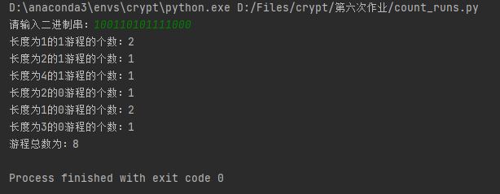
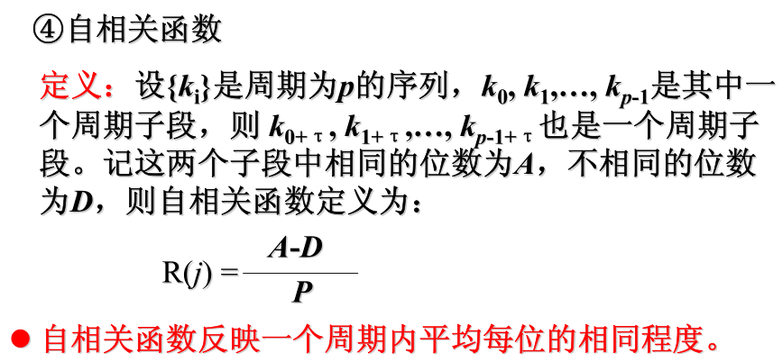
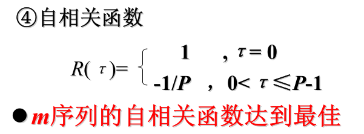
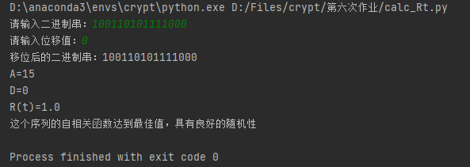
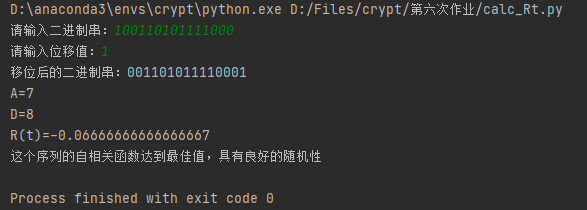
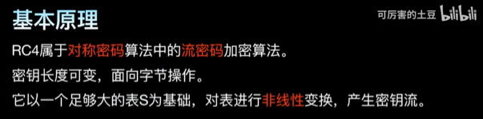
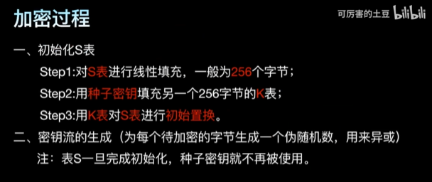
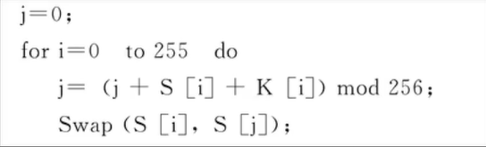
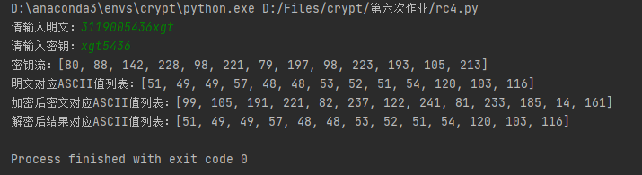

# 密码学作业汇总

## 完整内容

### 第二次作业

####  量子计算机

量子计算机（quantum computer）是一类遵循量子力学规律进行高速数学和逻辑运算、存储及处理量子信息的物理装置。当某个装置处理和计算的是量子信息，运行的是量子算法时，它就是量子计算机。

#### DNA计算机

DNA计算机是一种生物形式的计算机。它是利用DNA(脱氧核糖核酸)建立的一种完整的信息技术形式，以编码的DNA序列(通常意义上计算机内存)为运算对象，通过分子生物学的运算操作以解决复杂的数学难题。

#### 云计算

云计算（cloud computing）是基于互联网的相关服务的增加、使用和交付模式，通常涉及通过互联网来提供动态易扩展且经常是虚拟化的资源。云是网络、互联网的一种比喻说法。过去在图中往往用云来表示电信网，后来也用来表示互联网和底层基础设施的抽象。因此，云计算甚至可以让你体验每秒10万亿次的运算能力，拥有这么强大的计算能力可以模拟核爆炸、预测气候变化和市场发展趋势。用户通过电脑、笔记本、手机等方式接入数据中心，按自己的需求进行运算。 对云计算的定义有多种说法。对于到底什么是云计算，至少可以找到100种解释。现阶段广为接受的是美国国家标准与技术研究院（NIST）定义：云计算是一种按使用量付费的模式，这种模式提供可用的、便捷的、按需的网络访问， 进入可配置的计算资源共享池（资源包括网络，服务器，存储，应用软件，服务），这些资源能够被快速提供，只需投入很少的管理工作，或与服务供应商进行很少的交互。

#### 大数据

大数据（big data），指无法在一定时间范围内用常规软件工具进行捕捉、管理和处理的数据集合，是需要新处理模式才能具有更强的决策力、洞察发现力和流程优化能力的海量、高增长率和多样化的信息资产。 在维克托·迈尔-舍恩伯格及肯尼斯·库克耶编写的《大数据时代》中大数据指不用随机分析法（抽样调查）这样捷径，而采用所有数据进行分析处理。大数据的5V特点（IBM提出）：Volume（大量）、Velocity（高速）、Variety（多样）、Value（低价值密度）、Veracity（真实性）。

#### AI

人工智能（英语：artificial intelligence，缩写为AI）亦称智械、机器智能，指由人制造出来的机器所表现出来的智能。通常人工智能是指通过普通计算机程序来呈现人类智能的技术。该词也指出研究这样的智能系统是否能够實現，以及如何實現。同时，通过医学、神经科学、机器人学及统计学等的进步，常态预测则认为人类的很多职业也逐渐被其取代。

#### 区块链

区块链是一个信息技术领域的术语。从本质上讲，它是一个共享数据库，存储于其中的数据或信息，具有“不可伪造”“全程留痕”“可以追溯”“公开透明”“集体维护”等特征。基于这些特征，区块链技术奠定了坚实的“信任”基础，创造了可靠的“合作”机制，具有广阔的运用前景。


#### 参考链接

> [量子计算机-百度百科](https://baike.baidu.com/item/%E9%87%8F%E5%AD%90%E8%AE%A1%E7%AE%97%E6%9C%BA/363335)
>
> [DNA计算机-360百科](https://baike.so.com/doc/5448105-5686473.html#:~:text=%20DNA%E8%AE%A1%E7%AE%97%E6%9C%BA%E6%98%AF%E4%B8%80%E7%A7%8D%E7%94%9F%E7%89%A9%E5%BD%A2%E5%BC%8F%E7%9A%84%E8%AE%A1%E7%AE%97%E6%9C%BA%E3%80%82,%E5%AE%83%E6%98%AF%E5%88%A9%E7%94%A8DNA%20%28%E8%84%B1%E6%B0%A7%E6%A0%B8%E7%B3%96%E6%A0%B8%E9%85%B8%29%E5%BB%BA%E7%AB%8B%E7%9A%84%E4%B8%80%E7%A7%8D%E5%AE%8C%E6%95%B4%E7%9A%84%E4%BF%A1%E6%81%AF%E6%8A%80%E6%9C%AF%E5%BD%A2%E5%BC%8F%EF%BC%8C%E4%BB%A5%E7%BC%96%E7%A0%81%E7%9A%84DNA%E5%BA%8F%E5%88%97%20%28%E9%80%9A%E5%B8%B8%E6%84%8F%E4%B9%89%E4%B8%8A%E8%AE%A1%E7%AE%97%E6%9C%BA%E5%86%85%E5%AD%98%29%E4%B8%BA%E8%BF%90%E7%AE%97%E5%AF%B9%E8%B1%A1%EF%BC%8C%E9%80%9A%E8%BF%87%E5%88%86%E5%AD%90%E7%94%9F%E7%89%A9%E5%AD%A6%E7%9A%84%E8%BF%90%E7%AE%97%E6%93%8D%E4%BD%9C%E4%BB%A5%E8%A7%A3%E5%86%B3%E5%A4%8D%E6%9D%82%E7%9A%84%E6%95%B0%E5%AD%A6%E9%9A%BE%E9%A2%98%E3%80%82)
>
> [云计算-知乎](https://www.zhihu.com/topic/19550358/intro)
>
> [大数据-知乎](https://www.zhihu.com/topic/19740929/intro)
>
> [AI-维基百科](https://zh.wikipedia.org/wiki/%E4%BA%BA%E5%B7%A5%E6%99%BA%E8%83%BD)
>
> [区块链](https://baike.baidu.com/item/%E5%8C%BA%E5%9D%97%E9%93%BE/13465666)

### 第三次作业
#### 异或加密

##### 要求
- 对任意类型的数据文件加解密，其中密钥由用户输入，使用可打印字符
- 使用图形化界面
- 使用Git管理

##### 功能
###### 文件预览
打开文件、加密、解密功能将内容显示在文本框中
###### 日志
日志动态打印，记录各模块运行情况及错误报告
###### 加密
加密读取后的文件内容
###### 解密
解密读取的加密文件

##### 核心算法
- 异或加解密算法

    利用异或运算的**可逆性**，即可选用相同的密钥进行异或运算实现加密与解密。因此以二进制方式读取文件，选取与二进制原文等长的密钥逐位进行异或运算完成加密，以加密后的二进制内容再与密钥逐位进行异或运算完成解密。

1. 加密
```python
def encrypt(orig_data, key_words):
    """
    异或加密
    :param orig_data: 原始数据
    :param key_words: 密钥
    :return: str
    """
    data_len = len(orig_data)  # 获取原始数据长度
    key_len = len(key_words)  # 获取密钥长度
    key = data_len // key_len * key_words + key_words[: data_len % key_len]  # 将密钥扩展至于原始数据等长
    result = []
    for i in range(len(key)):
        result.append(chr(ord(key[i]) ^ ord(orig_data[i])))  # 异或逐位加密
    return ''.join(result)  # 以str类型返回结果
```

2. 解密
```python
def decrypt(encrypt_data, key_words):
    """
    异或解密
    :param encrypt_data: 加密数据
    :param key_words: 密钥
    :return: str
    """
    data_len = len(encrypt_data)  # 获取加密数据长度
    key_len = len(key_words)  # 获取密钥长度
    key = data_len // key_len * key_words + key_words[: data_len % key_len]  # 将密钥扩展至于原始数据等长
    result = []
    for i in range(len(key)):
        result.append(chr(ord(encrypt_data[i]) ^ ord(key[i])))      # 异或逐位解密
    return ''.join(result)      # 以str类型返回结果
```

##### 使用说明
###### 打开文件
打开默认路径(D盘)下的文件，在文件预览中显示
###### 输入密钥
弹出窗口提示输入密钥，由用户键入密钥
###### 加密
点击加密后将加密结果打印在文件预览中并写入文件
###### 解密
点击解密后将解密结果打印在文件预览中并写入文件

##### 运行结果
##### 打开文件

###### 输入密钥

###### 加密

###### 解密


#### 哈希
##### 要求
- 用md5算法和sha1算法计算磁盘文件的Hash值，并将结果输出为文本文件
- 使用图形化界面
- 使用Git管理

##### 功能
###### 日志
日志动态打印，记录各模块运行情况及错误报告
###### 计算Hash值
分别使用md5算法和sha1算法计算文件的Hash值

##### 核心算法
Python依赖：hashlib库

> [MD5算法--知乎](https://zhuanlan.zhihu.com/p/37257569) <br>
> [MD5算法和SHA1算法--简书](https://www.jianshu.com/p/38c93c677124) <br>
> [常见安全算法（MD5、SHA1、Base64等等）总结-知乎](https://zhuanlan.zhihu.com/p/68455533)

1. md5
```python
import hashlib

def Hash_md5(file_path, Bytes=1024):
    """
    计算文件的哈希值(md5算法)
    :param file_path: 文件路径
    :param Bytes: 读取字节数
    :return: str
    """
    md5 = hashlib.md5()     # 创建一个md5算法对象
    with open(file_path, 'rb') as f:        # 打开文件
        while True:
            data = f.read(Bytes)    # 每次只读取固定字节
            if data:    # 当读取内容不为空时对读取内容进行更新
                md5.update(data)
            else:   # 当整个文件读完之后停止更新
                break
    res = md5.hexdigest()       # 获取这个文件的md5值(十六进制)
    return res
```

2. sha1
```python
import hashlib

def Hash_sha1(file_path, Bytes=1024):
    """
    计算文件的哈希值(sha1算法)
    :param file_path: 文件路径
    :param Bytes: 读取字节数
    :return: str
    """
    sha1 = hashlib.sha1()  # 创建一个sha1算法对象
    with open(file_path, 'rb') as f:  # 打开文件
        while True:
            data = f.read(Bytes)  # 每次只读取固定字节
            if data:  # 当读取内容不为空时对读取内容进行更新
                sha1.update(data)
            else:  # 当整个文件读完之后停止更新
                break
    res = sha1.hexdigest()  # 获取这个文件的sha1值(十六进制)
    return res
```

##### 使用说明
###### 打开文件
弹窗提示打开文件，可多次添加文件。打开文件后日志记录打开的文件个数和当前已读文件列表
###### 打开文件夹
弹出提示打开文件夹，选择文件夹后将获取文件夹下所有文件
###### 清空文件列表
重置已读文件列表，将其清空
###### 计算Hash值
已读文件列表为空时，提示打开文件。已读文件列表非空时，对文件列表中的所有文件，分别使用md5算法和sha1算法计算文件的Hash值，并将计算结果写入文件

##### 运行结果
###### 打开文件

###### 打开文件夹

###### 清空文件列表

###### 计算Hash值
- 程序运行截图
  
    
- 输出文件截图
  
    

### 第四次作业
#### 要求
1. 搜索DES的源代码
2. 利用DES源代码实现以下功能：
    1. 统计DES算法在密钥固定情况，输入明文改变1位、2位，...，64位时，输出密文位数改变情况
    2. 统计DES算法在明文固定情况，输入密钥改变1位、2位，...，64位时，输出密文位数改变情况
    > 为了具有客观性，各小题需要对多次进行统计，并计算其平均值

#### 实现
1. DES源代码 

   DES源代码参考Python的第三方库pyDes 

   链接：[GitHub](https://github.com/twhiteman/pyDes)

2. DES算法实现

   参考DES源码的核心算法，添加一些辅助功能，并通过教材给出的加密例子进行验证保证算法准确性

   DES核心算法如下：

   ```python
   def des_crypt(block, Kn, crypt_type):
       """
       DES核心算法
       :param block: bit list
       :param Kn: sub keys
       :param crypt_type: ENCRYPT / DECRYPT
       :return: bit list
       """
       # 初始置换
       block = _permutate(_ip, block)
       L = block[:32]
       R = block[32:]
   
       # 加密从Kn[1]到Kn[16] (下标从0开始)
       if crypt_type == _ENCRYPT:
           iteration = 0
           iteration_adjustment = 1
       # 解密从Kn[16]到Kn[1]
       else:
           iteration = 15
           iteration_adjustment = -1
   
       i = 0
       while i < 16:
           # 复制R[i-1]，将会变成L[i]
           tempR = R[:]
   
           # 选择运算E
           R = _permutate(_expansion_table, R)
   
           # 中间结果与子密钥相异或，切分为8块
           R = list(map(lambda x, y: x ^ y, R, Kn[iteration]))
           B = [R[:6], R[6:12], R[12:18], R[18:24],
                R[24:30], R[30:36], R[36:42], R[42:]]
   
           # 代替函数组S
           j = 0
           Bn = [0] * 32
           pos = 0
           while j < 8:
               # 计算偏移量
               m = (B[j][0] << 1) + B[j][5]  # 行号
               n = (B[j][1] << 3) + (B[j][2] << 2) + (B[j][3] << 1) + B[j][4]  # 列号
   
               # 求排列值(S盒的输出值)
               v = _S_box[j][(m << 4) + n]
   
               # 将值转换为位，写入Bn
               Bn[pos] = (v & 8) >> 3
               Bn[pos + 1] = (v & 4) >> 2
               Bn[pos + 2] = (v & 2) >> 1
               Bn[pos + 3] = v & 1
   
               pos += 4
               j += 1
   
           # 置换运算P
           R = _permutate(_p, Bn)
   
           R = list(map(lambda x, y: x ^ y, R, L))
   
           # L[i] = R[i - 1]
           L = tempR
   
           i += 1
           iteration += iteration_adjustment
   
       # 逆初始置换IP^-1 (R在左 L在右)
       final = _permutate(_fp, R + L)
       return final
   ```

3. 统计分析

   1. 统计分析算法
   
      以固定密钥改变明文为例：
   
      ```python
      input_key = "gdut5436"
      input_data = "5436GDUT"
      orig_res = encrypt(input_data, input_key)       # 加密得到初始密文
      test_times = int(input("input test times: "))   # 测试次数
      change_data_result_list = []
      
      i = 0
      while i < test_times:
          count_num_list = []
          for j in range(1, 65):
              test_data = string2bit(input_data)
              pos_list = random.sample(range(64), j)  # 改变的数据位置
              for pos in pos_list:
                  # 对应位取反
                  if test_data[pos] == 0:
                      test_data[pos] = 1
                  else:
                      test_data[pos] = 0
              changed_res = encrypt(bit2string(test_data), input_key)  # 改变数据后加密得到的密文
      
              # 统计改变位数
              count_num = 0
              for t in range(64):
                  if changed_res[0][t] != orig_res[0][t]:
                      count_num += 1
              count_num_list.append(count_num)
      
          change_data_result_list.append(count_num_list)
          i += 1
      ```
   
   2. 统计DES算法在密钥固定情况，输入明文改变1位、2位，...，64位时，输出密文位数改变情况
   
      - 测试五次的统计结果
   
        
   
      - 测试5000次后的平均统计结果
   
        
   
   3. 统计DES算法在明文固定情况，输入密钥改变1位、2位，...，64位时，输出密文位数改变情况
   
      - 测试五次的统计结果
   
        
   
      - 测试5000次后的平均统计结果
   
        

### 第五次作业
#### 要求
- 求两个数的最大公约数。
- 判断一个数是否为素数。可以利用试除法或者教材P221 算法 
- 实现扩展欧几里得算法，可以计算模逆 
- 利用教材P221 反复平方乘算法，可以模指 
- 利用上述函数，实现RSA算法，ElGamal算法，DH密钥交换协议。 

#### 已实现
##### 基本函数
- 求两个数的最大公约数

递归法：
```python
def gcd_recursion(a, b):
    """
    递归法计算两个数的最大公约数: a = q * b + r

    :param a: int
    :param b: int
    :return: int
    """
    if b == 0:
        return a
    else:
        return gcd_recursion(b, a % b)
```
迭代法：
```python
def gcd_iteration(a, b):
    """
    迭代法计算两个数的最大公约数: a = q * b + r

    :param a: int
    :param b: int
    :return: int
    """
    while True:
        r = a % b  # Calculate the remainder
        if r == 0:
            break
        # Change the value of a and b
        a = b
        b = r
    return b
```
- 判断一个数是否是素数

试除法：
```python
def is_prime(n):
    """
    试除法判断整数n是否是素数

    :param n: int
    :return: bool：是素数返回True，否则返回False
    """
    i = 2  # 从2开始穷举
    while i <= math.sqrt(n):  # 穷举到sqrt(n)
        if n % i == 0:  # 是素数
            return False
        i += 1
    return True
```
参考Python第三方库primePy：
```python
def _factor(num):
    """
    Calculates the lowest prime factor by default

    :param num: int
    :return: int
    """
    if num == 2 or num % 2 == 0:
        return 2
    else:
        for i in range(3, int(math.sqrt(num)) + 1, 2):  # I could iterate over a list of primes
            if num % i == 0:  # But creating that list of primes turns out even more intensive task
                return i
        else:
            return num


def prime_check(num):
    """
    判断是否是素数，参考Python第三方库primePy

    :param num: int
    :return: bool: 是素数返回True，否则返回False
    """
    # from primePy import primes
    # primes.check()

    if _factor(num) == num:
        return True
    else:
        return False
```
- 扩展欧几里得算法计算模逆
```python
def InvMod(a, b):
    """
    递归实现扩展欧几里得算法: ed = 1 (mod n)

    :param a: e(int)
    :param b: n(int)
    :return: gcd, x, y (x即是e^-1，也就是d)(int, int, int)
    """
    if b == 0:
        return a, 1, 0
    else:
        gcd, x, y = InvMod(b, a % b)
        t = x
        x = y
        y = t - a // b * y
        return gcd, x, y
```
- 反复平方乘算法计算模幂
```python
def ExpMod(a, b, n):
    """
    模指运算: a^b (mod n)

    :param a: int
    :param b: int
    :param n: int
    :return: int
    """
    b = bin(b)[2:]  # 获取二进制，去掉开头的'0b'
    # 快速平方乘算法得到列表
    L = [a]
    for i in range(len(b) - 1):
        a = a * a
        L.append(a)
    L.reverse()  # 列表反转，与二进制位对应
    # 对二进制值中为1的项相乘并模n
    res = 1
    for i in range(len(b)):
        if b[i] == '1':
            # 边乘边模
            res *= L[i]
            res %= n
    return res
```
- 随机生成二进制位数为n的大素数p、q
```python
def generate_p_q(n_bit):
    """
    随机生成二进制位数为n的大素数p、q

    :param n_bit: int，整数对应的二进制位数
    :return: (p, q)
    """
    # 随机生成n位二进制所对应的十进制整数
    if n_bit <= min_size:
        raise ValueError("n太小了，n必须大于" + str(min_size) + "，n值建议小于50")
    randint_list = ['1'] * n_bit  # 初始化长度为n的列表
    # 随机更改数据的位置
    pos_list = random.sample(range(1, n_bit), random.randint(min_size, n_bit) - 1)
    for pos in pos_list:
        randint_list[pos] = '0'
    randint_str = ''.join(randint_list)  # 列表转字符串
    randint = int(randint_str, 2)  # 十进制值
    # 获取p, q
    while not prime_check(randint):
        randint += 1
    p = randint
    randint += random.randint(min_size, n_bit)  # 加上随机数得到新的随机整数
    while not prime_check(randint):
        randint += 1
    q = randint
    return p, q
```
- 随机生成n位的素数
```python
def generate_prime(n_digit):
    """
    随机生成n位的素数

    :param n_digit: int，素数位数
    :return: int，n位素数
    """
    if n_digit < 1:
        raise ValueError("素数位数不能小于1")
    rand_list = random.sample([str(i) for i in range(1, 10)], 9)  # 初始化1-9的不重复列表，防止生成类似999的整数，影响后续操作
    randint_list = rand_list[: n_digit]
    if n_digit > 9:  # 超过位数则补齐
        while len(randint_list) < n_digit:
            randint_list.append(str(random.randint(0, 9)))
    randint = int("".join(randint_list))  # 转为整数
    while not prime_check(randint):  # 得到素数
        randint += 1
    return randint
```
- 生成大素数p及其本原元g
```python
def generate_p_g(n_digit):
    """
    生成大素数p及其本原元g

    :param n_digit: int，素数位数
    :return: (p, q), (int, int)
    """
    while True:
        q = generate_prime(n_digit)  # 随机生成一个n位的素数q
        if prime_check(2 * q + 1):  # 判断 2*q+1 是否为素数
            p = 2 * q + 1
            break
    while True:
        g = random.randint(2, p - 2)  # 随机选取整数g，g范围：(1, p - 1)
        if ExpMod(g, 2, p) != 1 and pow(g, q, p) != 1:  # 左边用了自己写的模指运算函数，右边用Python自带函数速度快一点
            break
    return p, g
```
##### RSA
RSA加解密算法：


##### ElGamal
- 准备及生成密钥


构造素数的本原元：[构造一个大素数条件下的本原元（JAVA实现）](https://blog.csdn.net/qq_37685156/article/details/88190088)
- 加密


- 解密


##### DH(Diffie-Hellman)
算法：[DH密钥交换](https://blog.csdn.net/chengqiuming/article/details/83002352)
#### 程序说明
- python依赖：无
- 程序执行

    可单独执行RSA.py/EIGamal.py/DH.py
  
    或执行main.py通过选择菜单执行不同算法

#### 运行结果
- RSA


  从上图可以看出解密结果与原文相同
- ElGamal


  从上图可以看出A、B的解密结果均与原文相同
- DH


  从上图可以看出A、B的计算出的密钥相同

### 第六次作业
#### 要求
- 对输入的二进制位串进行游程统计
- 对输入的二进制位串和位移计算自相关系数
- 实现RC4密码

#### 已实现
##### 对输入的二进制位串进行游程统计
1. 介绍

    游程：称序列中连续的i个1的为长度等于i的1游程，称序列中连续的i个0位长度等于i的0游程
  
2. 算法

    逐位遍历二进制位串，计算连续出现的次数并添加进列表，再对列表中的重复值进行统计
  
3. 实现
```python
def count(bit_stream, bit_count):
    """
    统计0或1连续出现的次数

    :param bit_stream: 比特流
    :param bit_count: 0/1
    :return: list
    """
    count_list = []
    count_num = 0
    for bit in bit_stream:
        if bit == str(bit_count):
            count_num += 1
        else:
            if count_num != 0:
                count_list.append(count_num)
            count_num = 0
    # 处理漏网之鱼
    if count_num != 0:
        count_list.append(count_num)
    return count_list


def main():
    bit_stream = input("请输入二进制串：")
    # 统计0游程和1游程的个数
    one = count(bit_stream, 1)
    zero = count(bit_stream, 0)
    runs_sum = 0
    # 打印结果
    for key, value in dict(Counter(one)).items():
        runs_sum += value
        print("长度为" + str(key) + "的1游程的个数：" + str(value))
    for key, value in dict(Counter(zero)).items():
        runs_sum += value
        print("长度为" + str(key) + "的0游程的个数：" + str(value))
    print("游程总数为：" + str(runs_sum))
```

4. 运行结果截图

    

##### 对输入的二进制位串和位移计算自相关系数
1. 介绍





2. 算法

    根据输入的位移值循环左移二进制位串，逐位进行比较统计得到相同的位数和不相同的位数
3. 实现
```python
def main():
    bit_stream = input("请输入二进制串：")
    t = int(input("请输入位移值："))
    p = len(bit_stream)
    bit_shift = bit_stream[t:] + bit_stream[:t]
    print("移位后的二进制串：" + bit_shift)
    a = 0
    d = 0
    for i in range(p):
        if bit_stream[i] == bit_shift[i]:
            a += 1
        else:
            d += 1
    Rt = (a - d) / p

    print("A=" + str(a))
    print("D=" + str(d))
    print("R(t)=" + str(Rt))

    if t == 0 and Rt == 1 or 0 < t <= p - 1 and Rt == -1 / p:
        print("这个序列的自相关函数达到最佳值，具有良好的随机性")
    else:
        print("该序列未通过自相关检测")
```
4. 运行结果截图





##### RC4密码
1. 介绍
- 基本原理

    
- 加密过程

    
- RC4算法的加解密
RC4加密时，将密钥字节k与明文字节模2相加便完成了加密。解密时，将密钥字节k与密文字节模2相加便完成了解密。
2. 算法
- 初始化S表

    
- 密钥流的生成

    
- 加解密算法

    遍历所有字节，将每位字节转为二进制位串后逐位进行异或运算
3. 实现
```python
def initialize_S(seed_key_list):
    """
    初始化S表

    :param seed_key_list: 种子密钥列表
    :return: 随机化处理后的S表
    """
    S = [i for i in range(256)]  # 线性填充S表
    # 用种子密钥填充R表
    R = []
    for i in range(256):
        k = i % len(seed_key_list)
        R.append(seed_key_list[k])
    # 用R表随机化S表
    j = 0
    for i in range(256):
        j = (j + S[i] + R[i]) % 256
        S[i], S[j] = S[j], S[i]
    return S


def generate_keyStream(S, plaintext_len):
    """
    密钥流的生成

    :param S: 随机化处理后的S表
    :param plaintext_len: 明文长度
    :return: (list)密钥流
    """
    j = 0
    Key_Stream = []
    for i in range(plaintext_len):
        i = (i + 1) % 256
        j = (j + S[i]) % 256
        S[i], S[j] = S[j], S[i]  # swap S[i] and S[j]
        h = (S[i] + S[j]) % 256
        Key_Stream.append(S[h])
    return Key_Stream


def crypt(text, Key_Stream):
    """
    加解密算法

    :param text: 加解密内容
    :param Key_Stream: 密钥流
    :return: (str)加解密结果
    """
    res_str = []
    for i in range(len(text)):
        res_str.append(Byte_OR(text[i], Key_Stream[i]))
    return res_str


def Byte_OR(Byte_A, Byte_B):
    """
    字节异或后返回int结果

    :param Byte_A: 字节A(整数字符)
    :param Byte_B: 字节B(整数字符)
    :return: int
    """
    res = ""
    # 转为ASCII码(str)并去掉开头的'0b'
    text_bin_str = bin(Byte_A)[2:]
    key_bin_str = bin(Byte_B)[2:]
    # 位数对齐并高位补零
    length = max(len(text_bin_str), len(key_bin_str))
    while len(text_bin_str) < length:
        text_bin_str = '0' + text_bin_str
    while len(key_bin_str) < length:
        key_bin_str = '0' + key_bin_str
    # 逐位异或
    for i in range(length):
        res += str(int(text_bin_str[i]) ^ int(key_bin_str[i]))
    return int(res, 2)  # 转为十进制数
```
4. 运行结果截图

    
