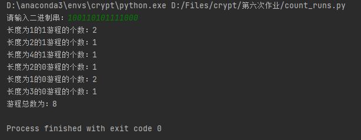
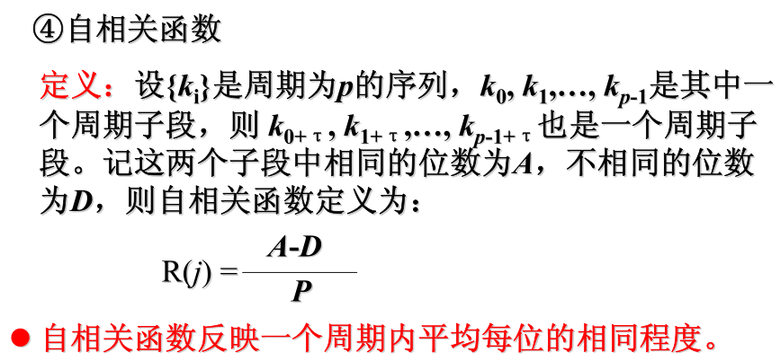
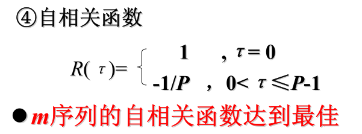
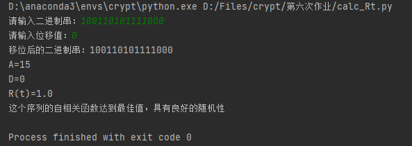
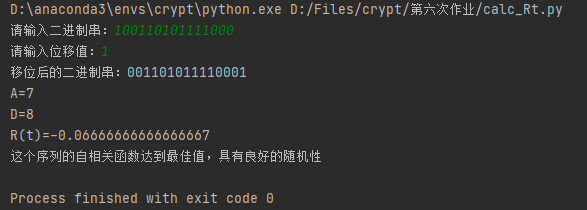
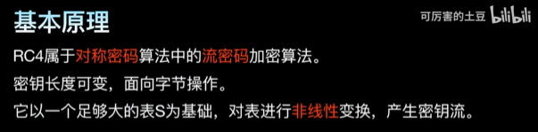
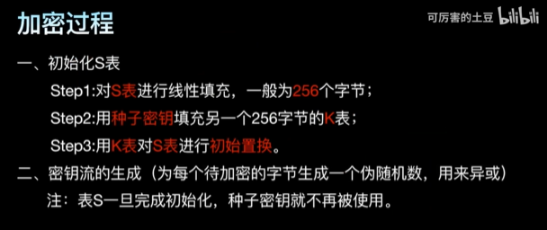
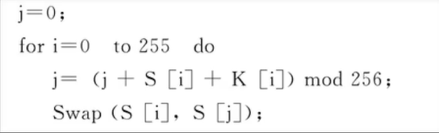
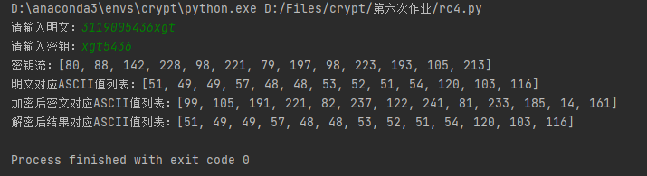

# 实验报告

> 姓名：徐国涛<br>
> 学号：3119005436

## 要求
- 对输入的二进制位串进行游程统计
- 对输入的二进制位串和位移计算自相关系数
- 实现RC4密码

## 已实现
### 对输入的二进制位串进行游程统计
1. 介绍
游程：称序列中连续的i个1的为长度等于i的1游程，称序列中连续的i个0位长度等于i的0游程
  
2. 算法
逐位遍历二进制位串，计算连续出现的次数并添加进列表，再对列表中的重复值进行统计
  
3. 实现
```python
def count(bit_stream, bit_count):
    """
    统计0或1连续出现的次数

    :param bit_stream: 比特流
    :param bit_count: 0/1
    :return: list
    """
    count_list = []
    count_num = 0
    for bit in bit_stream:
        if bit == str(bit_count):
            count_num += 1
        else:
            if count_num != 0:
                count_list.append(count_num)
            count_num = 0
    # 处理漏网之鱼
    if count_num != 0:
        count_list.append(count_num)
    return count_list


def main():
    bit_stream = input("请输入二进制串：")
    # 统计0游程和1游程的个数
    one = count(bit_stream, 1)
    zero = count(bit_stream, 0)
    runs_sum = 0
    # 打印结果
    for key, value in dict(Counter(one)).items():
        runs_sum += value
        print("长度为" + str(key) + "的1游程的个数：" + str(value))
    for key, value in dict(Counter(zero)).items():
        runs_sum += value
        print("长度为" + str(key) + "的0游程的个数：" + str(value))
    print("游程总数为：" + str(runs_sum))
```

4. 运行结果截图


   
### 对输入的二进制位串和位移计算自相关系数
1. 介绍




2. 算法
根据输入的位移值循环左移二进制位串，逐位进行比较统计得到相同的位数和不相同的位数
3. 实现
```python
def main():
    bit_stream = input("请输入二进制串：")
    t = int(input("请输入位移值："))
    p = len(bit_stream)
    bit_shift = bit_stream[t:] + bit_stream[:t]
    print("移位后的二进制串：" + bit_shift)
    a = 0
    d = 0
    for i in range(p):
        if bit_stream[i] == bit_shift[i]:
            a += 1
        else:
            d += 1
    Rt = (a - d) / p

    print("A=" + str(a))
    print("D=" + str(d))
    print("R(t)=" + str(Rt))

    if t == 0 and Rt == 1 or 0 < t <= p - 1 and Rt == -1 / p:
        print("这个序列的自相关函数达到最佳值，具有良好的随机性")
    else:
        print("该序列未通过自相关检测")
```
4. 运行结果截图


   


### RC4密码
1. 介绍
- 基本原理


- 加密过程


- RC4算法的加解密
RC4加密时，将密钥字节k与明文字节模2相加便完成了加密。解密时，将密钥字节k与密文字节模2相加便完成了解密。
2. 算法
- 初始化S表


- 密钥流的生成


- 加解密算法
遍历所有字节，将每位字节转为二进制位串后逐位进行异或运算
3. 实现
```python
def initialize_S(seed_key_list):
    """
    初始化S表

    :param seed_key_list: 种子密钥列表
    :return: 随机化处理后的S表
    """
    S = [i for i in range(256)]  # 线性填充S表
    # 用种子密钥填充R表
    R = []
    for i in range(256):
        k = i % len(seed_key_list)
        R.append(seed_key_list[k])
    # 用R表随机化S表
    j = 0
    for i in range(256):
        j = (j + S[i] + R[i]) % 256
        S[i], S[j] = S[j], S[i]
    return S


def generate_keyStream(S, plaintext_len):
    """
    密钥流的生成

    :param S: 随机化处理后的S表
    :param plaintext_len: 明文长度
    :return: (list)密钥流
    """
    j = 0
    Key_Stream = []
    for i in range(plaintext_len):
        i = (i + 1) % 256
        j = (j + S[i]) % 256
        S[i], S[j] = S[j], S[i]  # swap S[i] and S[j]
        h = (S[i] + S[j]) % 256
        Key_Stream.append(S[h])
    return Key_Stream


def crypt(text, Key_Stream):
    """
    加解密算法

    :param text: 加解密内容
    :param Key_Stream: 密钥流
    :return: (str)加解密结果
    """
    res_str = []
    for i in range(len(text)):
        res_str.append(Byte_OR(text[i], Key_Stream[i]))
    return res_str


def Byte_OR(Byte_A, Byte_B):
    """
    字节异或后返回int结果

    :param Byte_A: 字节A(整数字符)
    :param Byte_B: 字节B(整数字符)
    :return: int
    """
    res = ""
    # 转为ASCII码(str)并去掉开头的'0b'
    text_bin_str = bin(Byte_A)[2:]
    key_bin_str = bin(Byte_B)[2:]
    # 位数对齐并高位补零
    length = max(len(text_bin_str), len(key_bin_str))
    while len(text_bin_str) < length:
        text_bin_str = '0' + text_bin_str
    while len(key_bin_str) < length:
        key_bin_str = '0' + key_bin_str
    # 逐位异或
    for i in range(length):
        res += str(int(text_bin_str[i]) ^ int(key_bin_str[i]))
    return int(res, 2)  # 转为十进制数
```
4. 运行结果截图


   
